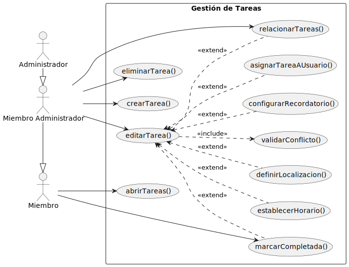
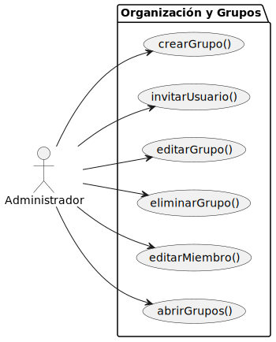
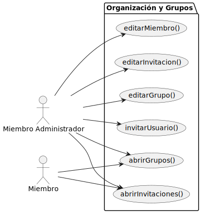
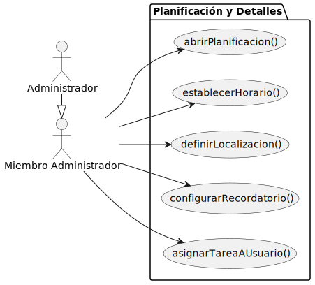
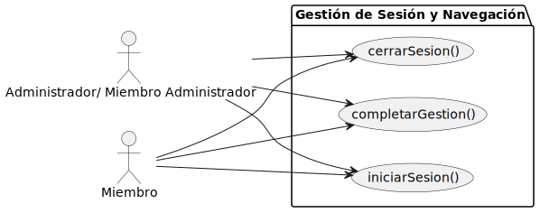

# Gestor de tareas familiares

## Diagrama de Gestión de Tareas 
| Diagrama | Código Fuente |
|----------|---------------|
| | [Ver código](./diagramas/diagramaGestionTareas/diagramaGestionTareas.puml) |

## Diagrama de Organizacion y Grupos 
| Diagrama Administrador | Código Fuente |
|----------|---------------|
| | [Ver código](./diagramas/diagramaOrganizaciónYGrupos/diagramaOrganizacionYGruposAdmin.puml) |

| Diagrama Miembro Administrador y Miembro | Código Fuente |
|----------|---------------|
| | [Ver código](./diagramas/diagramaOrganizaciónYGrupos/diagramaOrganizacionYGruposMiembroAdmin.puml) |

## Diagrama de Planificación Y Detalles 

| Diagrama | Código Fuente |
|----------|---------------|
| | [Ver código](./diagramas/diagramaPlanificaciónYDetalles/diagramaPlanificacionYDetalles.puml) |

## Diagrama de Gestión de Sesión y Navegación

| Diagrama | Código Fuente |
|----------|---------------|
| | [Ver código](./diagramas/diagramaGestionSesionYNavegacion/diagramaGestionSesionYNavegacion.puml) |

## Actores

### Administrador

Persona que gestiona el grupo familiar y controla toda la configuración. Puede crear y modificar miembros, tareas y reglas.

### Miembro Administrador

Persona que gestiona el grupo familiar y controla toda la configuración. Puede crear y modificar miembros, tareas y reglas, pero no tiene acceso a crear ni eliminar grupos.

### Miembro

Personas del grupo que consultan y realizan las tareas asignadas, marcan actividades completadas y visualizan la información general.

## Casos de uso

### [Gestión de sesión y navegación](./detalladoYPrototipado/gestionDeSesionYNavegacion/README.md)

1. [iniciarSesion()](./detalladoYPrototipado/gestionDeSesionYNavegacion/iniciarSesion/iniciarSesion.md)
2. [cerrarSesion()](./detalladoYPrototipado/gestionDeSesionYNavegacion/cerrarSesion/cerrarSesion.md)
3. [completarGestion()](./detalladoYPrototipado/gestionDeSesionYNavegacion/completarGestion/completarGestion.md)

### [Gestión de grupos y usuarios](./detalladoYPrototipado/gestionDeGruposYUsuarios/README.md)

1. [abrirGrupos()](./detalladoYPrototipado/gestionDeGruposYUsuarios/abrirGrupos/abrirGrupos.md)
2. [crearGrupo()](./detalladoYPrototipado/gestionDeGruposYUsuarios/crearGrupo/crearGrupo.md)
3. [editarGrupo()](./detalladoYPrototipado/gestionDeGruposYUsuarios/editarGrupo/editarGrupo.md)
4. [eliminarGrupo()](./detalladoYPrototipado/gestionDeGruposYUsuarios/eliminarGrupo/eliminarGrupo.md)
6. [invitarUsuario()](./detalladoYPrototipado/gestionDeGruposYUsuarios/invitarUsuario/invitarUsuario.md)
7. [editarMiembro()](./detalladoYPrototipado/gestionDeGruposYUsuarios/editarMiembro/editarMiembro.md)
7. [abrirInvitaciones()](./detalladoYPrototipado/gestionDeGruposYUsuarios/abrirInvitaciones/abrirInvitaciones.md)
7. [editarInvitacion()](./detalladoYPrototipado/gestionDeGruposYUsuarios/editarInvitacion/editarInvitacion.md)

### [Gestión de tareas](./detalladoYPrototipado/gestionDeTareas/README.md)

1. [abrirTareas()](./detalladoYPrototipado/gestionDeTareas/abrirTareas/abrirTareas.md)
2. [crearTarea()](./detalladoYPrototipado/gestionDeTareas/crearTarea/crearTarea.md)
3. [editarTarea()](./detalladoYPrototipado/gestionDeTareas/editarTarea/editarTarea.md)
4. [relacionarTareas()](./detalladoYPrototipado/gestionDeTareas/relacionarTareas/relacionarTareas.md)
5. [eliminarTarea()](./detalladoYPrototipado/gestionDeTareas/eliminarTarea/eliminarTarea.md)
6. [marcarCompletada()](./detalladoYPrototipado/gestionDeTareas/marcarCompletada/marcarCompletada.md)
6. [validarConflicto()](./detalladoYPrototipado/gestionDeTareas/validarConflicto/validarConflicto.md)

### [Planificación y configuración](./detalladoYPrototipado/planificacionYConfiguracion/README.md)

1. [abrirPlanificacion()](./detalladoYPrototipado/planificacionYConfiguracion/abrirPlanificacion/abrirPlanificacion.md)
2. [establecerHorario()](./detalladoYPrototipado/planificacionYConfiguracion/establecerHorario/establecerHorario.md)
3. [definirLocalizacion()](./detalladoYPrototipado/planificacionYConfiguracion/definirLocalizacion/definirLocalizacion.md)
4. [configurarRecordatorio()](./detalladoYPrototipado/planificacionYConfiguracion/configurarRecordatorio/configurarRecordatorio.md)
5. [asignarTareaAUsuario()](./detalladoYPrototipado/gestionDeGruposYUsuarios/asignarTareaAUsuario/asignarTareaAUsuario.md)