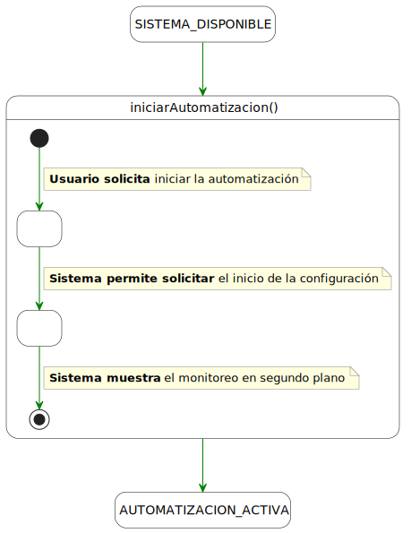
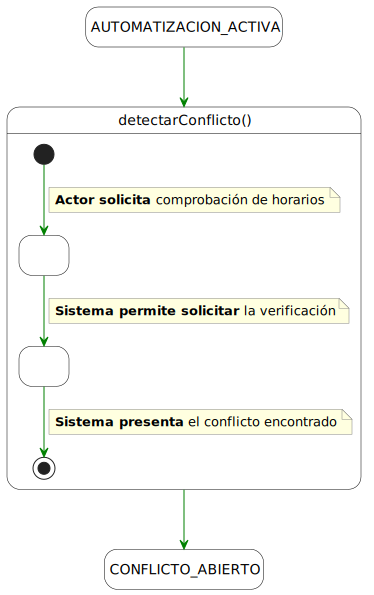
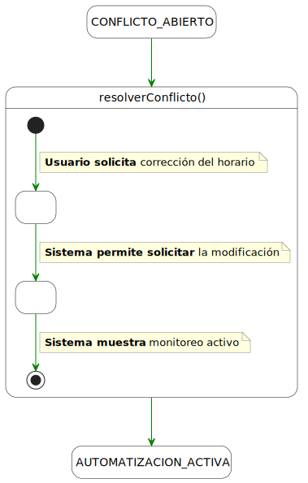
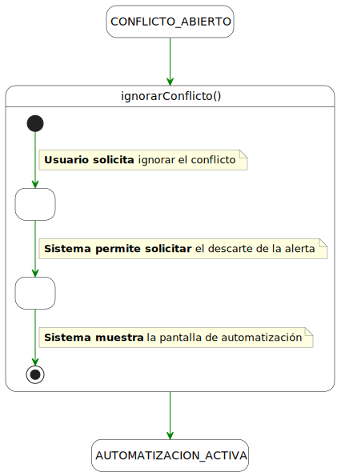

# Detallado de Casos de Uso: Automatizacion Actor Tiempo

## iniciarAutomatización()
| Diagrama | Código Fuente |
| :---: | :---: |
| | [Ver código](./iniciarAutomatizacion/iniciarAutomatizacion.puml) |

---

## detectarConflicto()
| Diagrama | Código Fuente |
| :---: | :---: |
| | [Ver código](./detectarConflictoHorario/detectarConflicto.puml) |

---

## resolverConflicto()
| Diagrama | Código Fuente |
| :---: | :---: |
| | [Ver código](./resolverConflicto/resolverConflicto.puml) |

---

## ignorarConflicto()
| Diagrama | Código Fuente |
| :---: | :---: |
| | [Ver código](./ignorarConflicto/ignorarConflicto.puml) |

