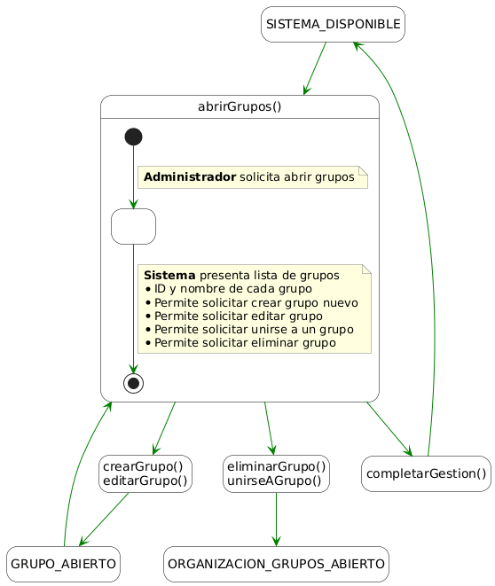
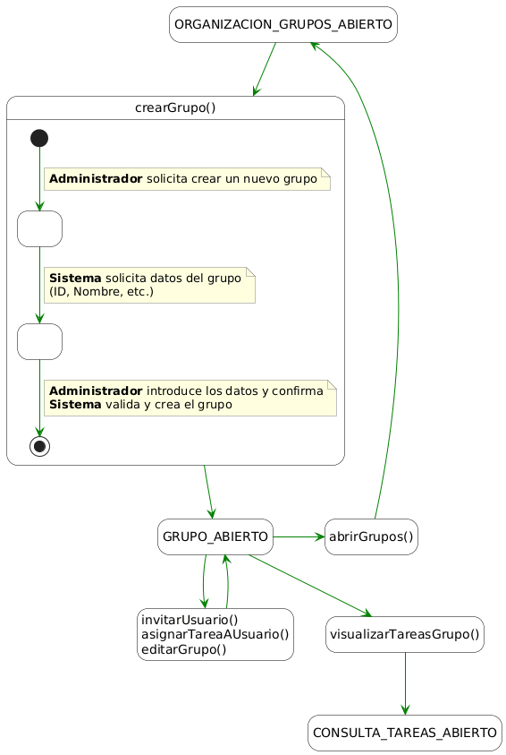
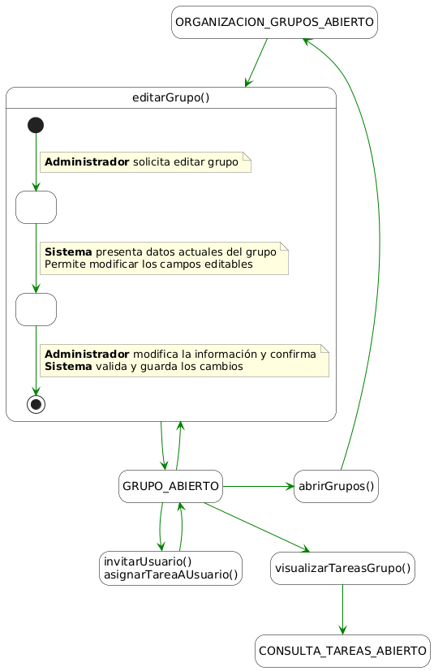
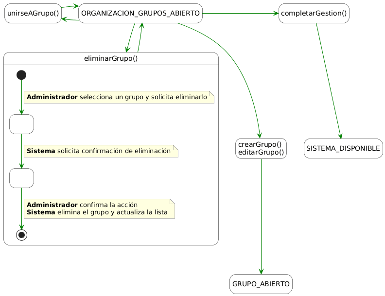
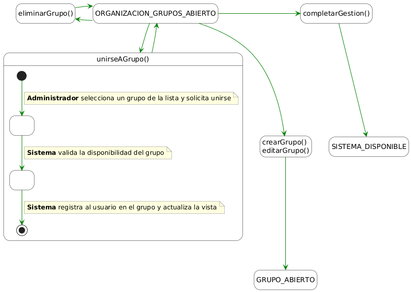
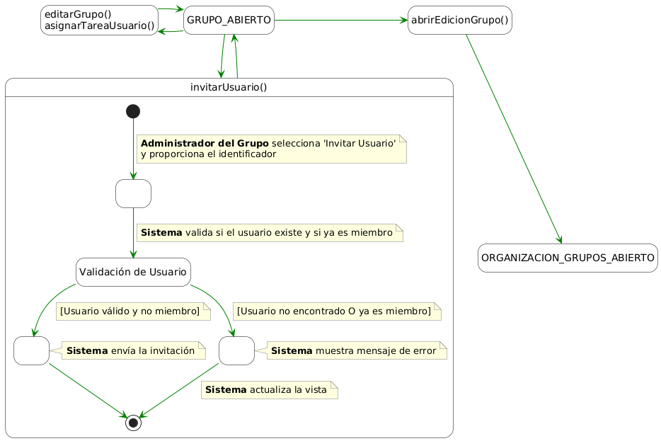
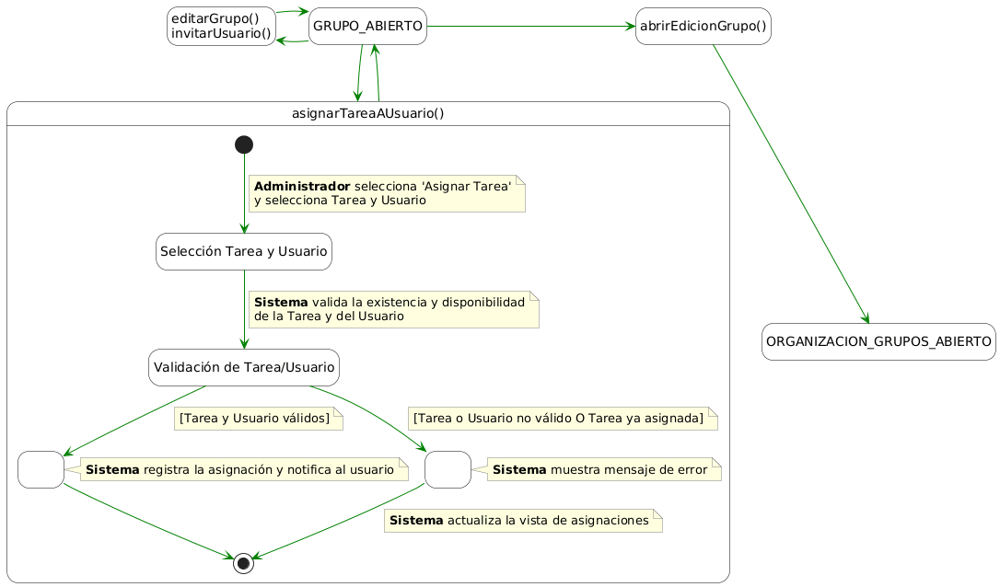
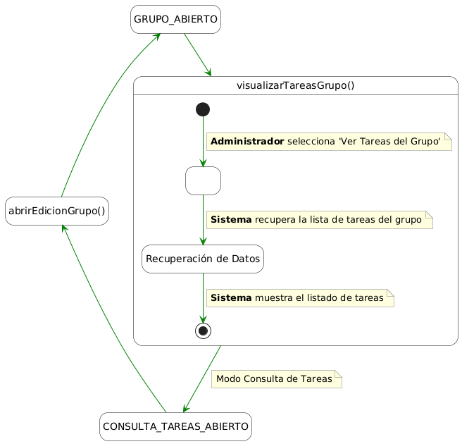
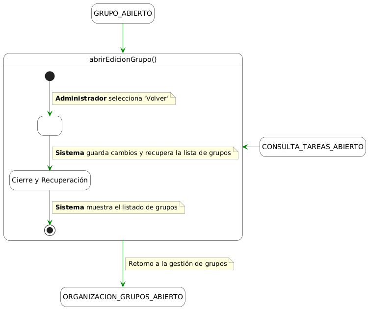

# Detallado de Casos de Uso: Gestión de grupos y usuarios

## abrirGrupos()
| Diagrama | Código Fuente |
| :---: | :---: |
| | [Ver código](./abrirGrupos/abrirGrupos.puml) |

---

## crearGrupo()
| Diagrama | Código Fuente |
| :---: | :---: |
| | [Ver código](./crearGrupo/crearGrupo.puml) |

---

## editarGrupo()
| Diagrama | Código Fuente |
| :---: | :---: |
| | [Ver código](./editarGrupo/editarGrupo.puml) |

---

## eliminarGrupo()
| Diagrama | Código Fuente |
| :---: | :---: |
| | [Ver código](./eliminarGrupo/eliminarGrupo.puml) |

---

## unirseAGrupo()
| Diagrama | Código Fuente |
| :---: | :---: |
| | [Ver código](./unirseAGrupo/unirseAGrupo.puml) |

---

## invitarUsuario()
| Diagrama | Código Fuente |
| :---: | :---: |
| | [Ver código](./invitarUsuario/invitarUsuario.puml) |

---

## asignarTareaAUsuario()
| Diagrama | Código Fuente |
| :---: | :---: |
| | [Ver código](./asignarTareaAUsuario/asignarTareaAUsuario.puml) |

---

## visualizarTareasGrupo()
| Diagrama | Código Fuente |
| :---: | :---: |
| | [Ver código](./visualizarTareasGrupo/visualizarTareasGrupo.puml) |

---

## abrirEdicionGrupo()
| Diagrama | Código Fuente |
| :---: | :---: |
| | [Ver código](./abrirEdicionGrupo/abrirEdicionGrupo.puml) |