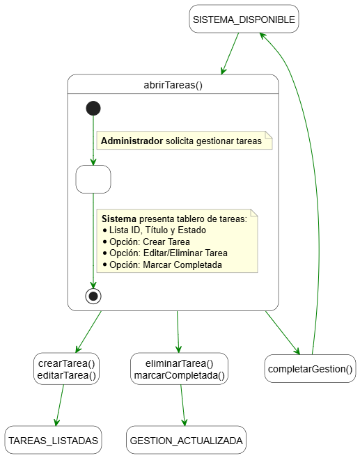
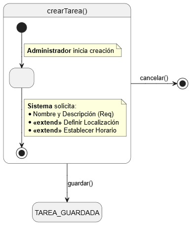
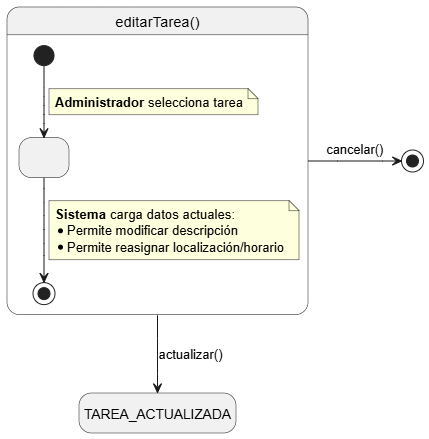
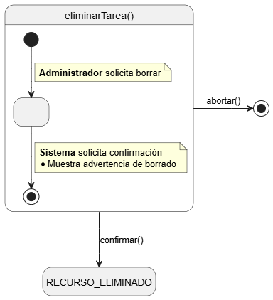
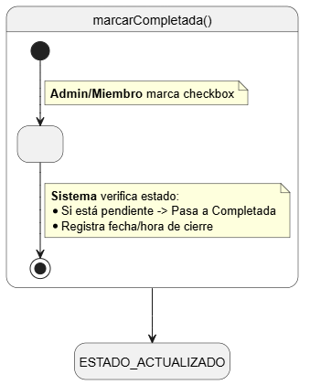

# Detallado de Casos de Uso: Gestión de Tareas

## abrirTareas()

| Diagrama | Código Fuente |
| :---: | :---: |
| | [Ver código](./abrirTareas/abrirTareas.puml) |

---

## crearTarea()

| Diagrama | Código Fuente |
| :---: | :---: |
| | [Ver código](./crearTarea/crearTarea.puml) |

---

## editarTarea()

| Diagrama | Código Fuente |
| :---: | :---: |
| | [Ver código](./editarTarea/editarTarea.puml) |

---

## eliminarTarea()

| Diagrama | Código Fuente |
| :---: | :---: |
| | [Ver código](./eliminarTarea/eliminarTarea.puml) |

---

## marcarCompletada()

| Diagrama | Código Fuente |
| :---: | :---: |
| | [Ver código](./marcarCompletada/marcarCompletada.puml) |
