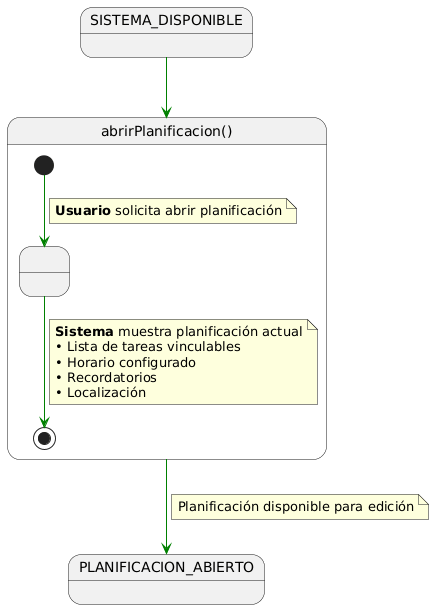
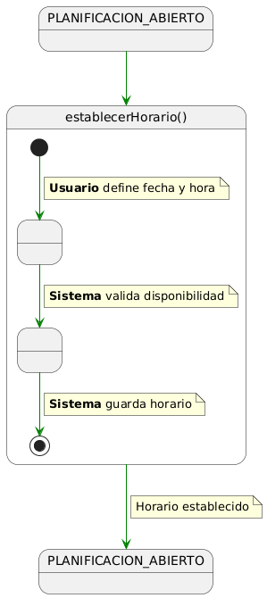
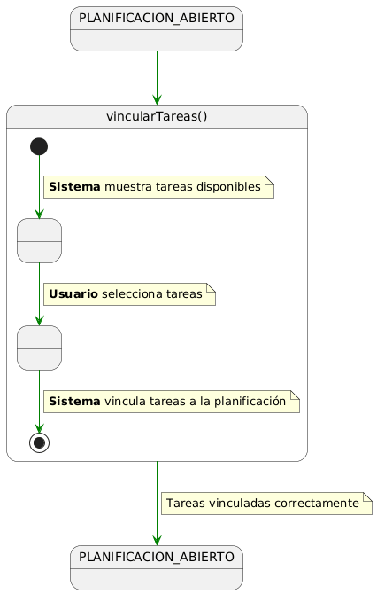
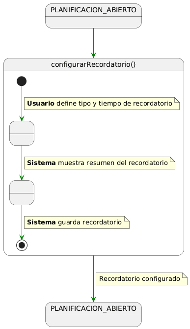
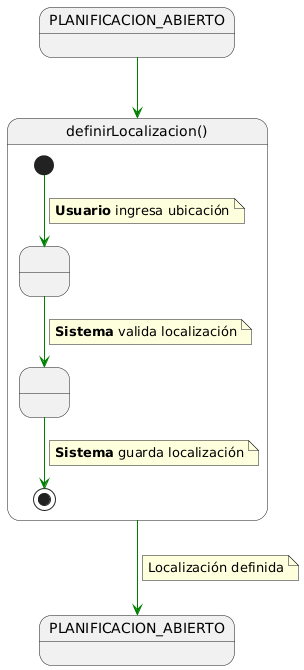

#  Detallado de Casos de Uso: Planificación y Configuración

## abrirPlanificacion()
| Diagrama | Código Fuente |
| :---: | :---: |
| | [Ver código](./abrirPlanificacion/abrirPlanificacion.puml) |

---

## establecerHorario()
| Diagrama | Código Fuente |
| :---: | :---: |
| | [Ver código](./establecerHorario/establecerHorario.puml) |

---

## vincularTareas()
| Diagrama | Código Fuente |
| :---: | :---: |
| | [Ver código](./vincularTareas/vincularTareas.puml) |

---

## configurarRecordatorio()
| Diagrama | Código Fuente |
| :---: | :---: |
| | [Ver código](./configurarRecordatorio/configurarRecordatorio.puml) |

---

## definirLocalizacion()
| Diagrama | Código Fuente |
| :---: | :---: |
| | [Ver código](./definirLocalizacion/definirLocalizacion.puml) |