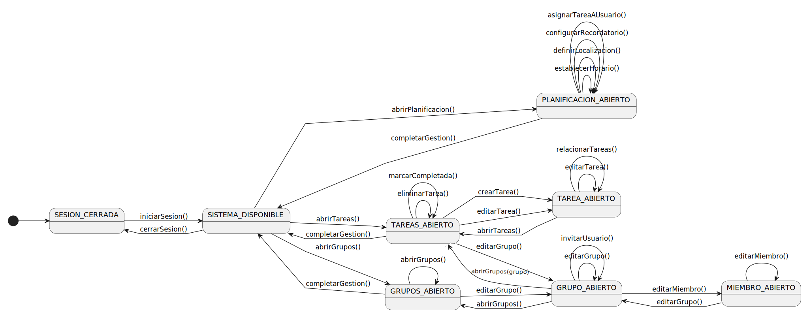

# Sistema de Gestión de Tareas > Diagramas de Contexto por Actor

---

# Diagramas por Actor

## 1. Administrador de aplicación (Gestión y Configuración)

Este diagrama modela el flujo de trabajo del usuario con privilegios de gestión de la aplicación. Incluye la creación, edición, eliminación y configuración de tareas, usuarios, grupos y planificación.

|
|-
|**Código fuente:** [diagramaContextoAdmin](diagramaContextoAdmin.puml)

---

## 2. Miembro Administrador (Usuario Administrador)

Este diagrama modela el flujo de trabajo del usuario con privilegios de gestión de grupo. Incluye la creación, edición, eliminación y configuración de tareas, usuarios y planificación.

|
|-
|**Código fuente:** [diagramaContextoMiembroAdmin](diagramaContextoMiembroAdmin.puml)

---

## 3. Miembro (Usuario Operacional)

Este diagrama representa el flujo de trabajo esencial para un usuario estándar, centrándose en el acceso a la gestión, consulta de tareas y aceptación de invitaciones.

|
|-
|**Código fuente:** [diagramaContextoMiembro](diagramaContextoMiembro.puml)

---

## Introducción

Este documento presenta los diagramas de contexto del sistema descompuestos por los actores principales. Esta aproximación modular mejora la comprensión de los flujos de trabajo específicos: la complejidad de la gestión y configuración (Administrador) y la sencillez de la operación diaria (Miembro).

---

## Propósito

- Mostrar la perspectiva específica de cada actor dentro del sistema.
- Especificar la secuencialidad de navegación mediante estados y transiciones.
- Definir las precondiciones de navegación de forma visual para cada contexto.
- Facilitar la comprensión de la separación de responsabilidades entre los actores.

# Estados Consolidados del Sistema

| Estado | Descripción | Actores Relevantes | Función principal |
|--------|-------------|---------------------|--------------------|
| **SESION_CERRADA** | Estado inicial del sistema | Administrador, Miembro Administrador, Miembro | Punto de entrada, requiere autenticación |
| **SISTEMA_DISPONIBLE** | Hub central de navegación | Administrador, Miembro Administrador, Miembro, Tiempo | Punto de acceso a los módulos |
| **TAREAS_ABIERTO** | Módulo principal de gestión | Administrador, Miembro Administrador, Miembro | Gestión general de tareas |
| **TAREA_ABIERTO** | Creación de una tarea | Administrador, Miembro Administrador | Recolección de datos mínimos |
| **PLANIFICACION_ABIERTO** | Módulo de detalles y horarios | Administrador, Miembro Administrador | Configuración de horarios y recordatorios |
| **GRUPOS_ABIERTO** | Gestión de grupos | Administrador, Miembro Administrador | Creación, unión y visualización |
| **GRUPO_ABIERTO** | Grupo específico | Administrador, Miembro Administrador | Gestión de miembros y tareas |
| **MIEMBRO_ABIERTO** | Miembro de grupo específico | Administrador, Miembro Administrador | Gestión de miembros |      
| **INVITACIONES_ABIERTO** | Listado de invitaciones | Miembro | Manejo de invitaciones |
| **INVITACION_ABIERTO** | Validación de invitación | Miembro | Gestión de invitación |

---
 
# Transiciones por Actor

## 1. Administrador (Gestión)

| Transición | Origen → Destino | Descripción |
|-----------|------------------|-------------|
| `iniciarSesion()` | SESION_CERRADA → SISTEMA_DISPONIBLE | Acceso al sistema |
| `cerrarSesion()` | SISTEMA_DISPONIBLE → SESION_CERRADA | Cierre de sesión |
| `abrirTareas()` | SISTEMA_DISPONIBLE / GRUPO_ABIERTO → TAREAS_ABIERTO | Acceso a la lista |
| `abrirPlanificacion()` | SISTEMA_DISPONIBLE → PLANIFICACION_ABIERTO | Configuración de planificación |
| `abrirGrupos()` | SISTEMA_DISPONIBLE / GRUPOS_ABIERTO → GRUPOS_ABIERTO | Gestión de grupos |
| `crearTarea()` | TAREAS_ABIERTO → TAREA_ABIERTO | Inicia creación |
| `editarTarea()` | TAREAS_ABIERTO / TAREA_ABIERTO → TAREA_ABIERTO | Edita tarea |
| `relacionarTareas()` | TAREA_ABIERTO → TAREA_ABIERTO | Relaciona una tarea con otra para crear subtarea |
| `asignarTareaAUsuario()` | PLANIFICACION_ABIERTO → PLANIFICACION_ABIERTO | Gestión de tareas |
| `establecerHorario()` | PLANIFICACION_ABIERTO → PLANIFICACION_ABIERTO | Acción autorreflexiva |
| `crearGrupo()` | GRUPO_ABIERTO → GRUPO_ABIERTO | Creación de grupos |
| `editarGrupo()` | GRUPOS_ABIERTO / GRUPO_ABIERTO / TAREAS_ABIERTO / MIEMBRO_ABIERTO → GRUPO_ABIERTO | Gestión de grupos |
| `eliminarGrupo()` | GRUPOS_ABIERTO → GRUPOS_ABIERTO | Eliminación de grupo |
| `invitarUsuario()` | GRUPO_ABIERTO → GRUPO_ABIERTO | Gestión de miembros |
| `editarMiembro()` | GRUPO_ABIERTO / MIEMBRO_ABIERTO → MIEMBRO_ABIERTO | Gestión de miembros |
| `completarGestion()` | Cualquier Estado Secundario → SISTEMA_DISPONIBLE | Retorno al menú |

---

## 2. Miembro Administrador (Gestión)

| Transición | Origen → Destino | Descripción |
|-----------|------------------|-------------|
| `iniciarSesion()` | SESION_CERRADA → SISTEMA_DISPONIBLE | Acceso al sistema |
| `cerrarSesion()` | SISTEMA_DISPONIBLE → SESION_CERRADA | Cierre de sesión |
| `abrirTareas()` | SISTEMA_DISPONIBLE / GRUPO_ABIERTO → TAREAS_ABIERTO | Acceso a la lista |
| `abrirPlanificacion()` | SISTEMA_DISPONIBLE → PLANIFICACION_ABIERTO | Configuración de planificación |
| `abrirGrupos()` | SISTEMA_DISPONIBLE / GRUPOS_ABIERTO → GRUPOS_ABIERTO | Gestión de grupos |
| `crearTarea()` | TAREAS_ABIERTO → TAREA_ABIERTO | Inicia creación |
| `editarTarea()` | TAREAS_ABIERTO / TAREA_ABIERTO → TAREA_ABIERTO | Edita tarea |
| `relacionarTareas()` | TAREA_ABIERTO → TAREA_ABIERTO | Relaciona una tarea con otra para crear subtarea |
| `asignarTareaAUsuario()` | PLANIFICACION_ABIERTO → PLANIFICACION_ABIERTO | Gestión de tareas |
| `establecerHorario()` | PLANIFICACION_ABIERTO → PLANIFICACION_ABIERTO | Acción autorreflexiva |
| `editarGrupo()` | GRUPOS_ABIERTO / GRUPO_ABIERTO / TAREAS_ABIERTO / MIEMBRO_ABIERTO → GRUPO_ABIERTO | Gestión de grupos |
| `invitarUsuario()` | GRUPO_ABIERTO → GRUPO_ABIERTO | Gestión de miembros |
| `editarMiembro()` | GRUPO_ABIERTO / MIEMBRO_ABIERTO → MIEMBRO_ABIERTO | Gestión de miembros |
| `completarGestion()` | Cualquier Estado Secundario → SISTEMA_DISPONIBLE | Retorno al menú |

---

## 3. Miembro (Operacional)

| Transición | Origen → Destino | Descripción |
|-----------|------------------|-------------|
| `iniciarSesion()` | SESION_CERRADA → SISTEMA_DISPONIBLE | Acceso |
| `cerrarSesion()` | SISTEMA_DISPONIBLE → SESION_CERRADA | Cierre |
| `abrirTareas()` | SISTEMA_DISPONIBLE → TAREAS_ABIERTO | Acceso a tareas |
| `marcarCompletada()` | TAREAS_ABIERTO → TAREAS_ABIERTO | Marca la tarea completada |
| `abrirInvitaciones()` | SISTEMA_DISPONIBLE / INVITACION_ABIERTO → INVITACIONES_ABIERTO | Manejo de invitaciones |
| `editarInvitacion()` | INVITACIONES_ABIERTO / INVITACION_ABIERTO → INVITACION_ABIERTO | Gestión de invitación |
| `completarGestion()` | TAREAS_ABIERTO → SISTEMA_DISPONIBLE | Regreso |

---

# Precondiciones visuales

## Autenticación requerida
El diagrama hace explícito que para acceder a **SISTEMA_DISPONIBLE**, el usuario debe completar `iniciarSesion()` desde el estado **SESION_CERRADA**.

## Navegación centralizada desde menú
El acceso a los módulos principales requiere pasar por **SISTEMA_DISPONIBLE**.

---

# Flujos de trabajo

## Flujo de Administrador
Requiere transitar por estados específicos como **TAREA_ABIERTO** o **GRUPOS_ABIERTO** para cualquier operación de configuración o modificación de estructura.

## Flujo de Miembro Administrador
Requiere transitar por estados específicos como **PLANIFICACION_ABIERTO** o **GRUPOS_ABIERTO** para cualquier operación de configuración o modificación de estructura, exceptuando la creación y eliminación de grupos.

## Flujo de Miembro
Las operaciones están restringidas a:
- La lectura (**TAREAS_ABIERTO**).
- Acciones autorreflexivas sobre tareas asignadas (`marcarCompletada()`).
- Validaciones de invitaciones a grupos.

---

# Validación de Flujos

## Separación de Contexto

- El flujo de **Administrador** es expansivo e incluye todas las transiciones de configuración, creación y gestión de infraestructura.
- El flujo de **Miembro Administrador** es expansivo e incluye todas las transiciones de configuración, creación y gestión de infraestructura, a excepción de la creación y eliminación de grupos.
- El flujo de **Miembro** es minimalista, enfocado solo en consumir y modificar el estado de sus tareas.    

## Cobertura de casos de uso

- **Gestión de Tareas (Administrador / Miembro Administrador):** creación, modificación, eliminación y asignación de tareas.    
- **Grupos (Administrador):** creación, eliminación, gestión de miembros y listado de tareas por grupo.
- **Grupos (Miembro Administrador):** gestión de miembros y listado de tareas por grupo.
- **Planificación (Administrador / Miembro Administrador):** definición de detalles espaciales y temporales de la tarea.
- **Operación de Tareas (Administrador / Miembro Administrador / Miembro):** visualización y marcado de completado de sus tareas asignadas.

---

# Optimización del flujo

## Patrón radial
Mantiene **SISTEMA_DISPONIBLE** como el hub central, facilitando una navegación intuitiva para todos los actores.

## Operaciones in situ
Las operaciones de modificación simple (ej. `marcarCompletada()`) son autorreflexivas, minimizando cambios de estado y mejorando la eficiencia.

---

# Características del diseño

## Patrón Hub Central
**SISTEMA_DISPONIBLE** actúa como punto central, concentrando el inicio de todos los flujos principales para los tres actores.

## Granularidad Descriptiva
Los estados son lo suficientemente específicos (ej. **TAREA_ABIERTO** vs. **TAREAS_ABIERTO**) para distinguir las fases de interacción de cada actor.

## Separación de Responsabilidades
- **Flujo de Tareas:** segmentado entre funciones de Administrador/Miembro Administrador (creación/configuración) y Miembro/Miembro Administrador (ejecución/consumo).  
- **Control de Acceso:** la dependencia estricta de `iniciarSesion()` asegura el control de acceso en la transición **SESION_CERRADA → SISTEMA_DISPONIBLE**.  
- **Retorno Consistente:** el uso de `completarGestion()` garantiza una navegación predecible hacia el menú principal.
