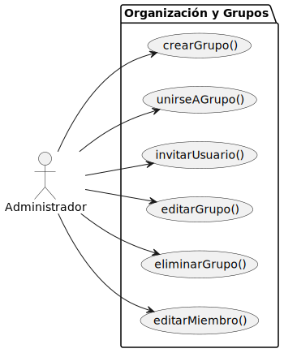
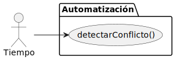
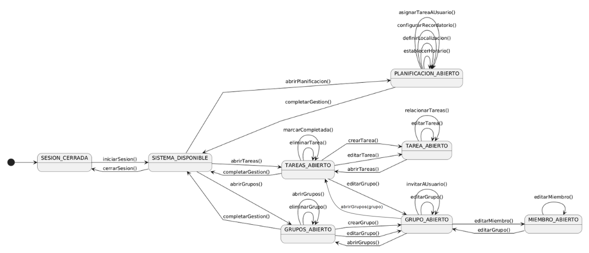
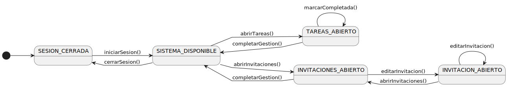

# Diagramas Actores y Casos de Uso

## Diagrama de Gestion de Tareas 
| Diagrama | Código Fuente |
|----------|---------------|
| | [Ver código](./diagramaGestionTareas/diagramaGestionTareas.puml) |

## Diagrama de Organizacion y Grupos 
| Diagrama | Código Fuente |
|----------|---------------|
| | [Ver código](./diagramaOrganizaciónYGrupos/diagramaOrganizacionYGrupos.puml) |

## Diagrama de Planificación Y Detalles 

| Diagrama | Código Fuente |
|----------|---------------|
| | [Ver código](./diagramaPlanificaciónYDetalles/diagramaPlanificacionYDetalles.puml) |

## Diagrama de Automatización 

| Diagrama | Código Fuente |
|----------|---------------|
| | [Ver código](./diagramaAutomatización/diagramaAutomatizacion.puml) |

# Diagramas de Contexto por Actor
### [Documentación](../diagramaContexto/README.md)

## Diagrama de Contexto - Administrador

| Diagrama | Código Fuente |
|----------|---------------|
| | [Ver código](../diagramaContexto/diagramaContextoAdmin.puml) |

## Diagrama de Contexto - Miembro

| Diagrama | Código Fuente |
|----------|---------------|
| | [Ver código](../diagramaContexto/diagramaContextoMiembro.puml) |

## Diagrama de Contexto - Tiempo

| Diagrama | Código Fuente |
|----------|---------------|
| | [Ver código](../diagramaContexto/diagramaContextoTiempo.puml) |
