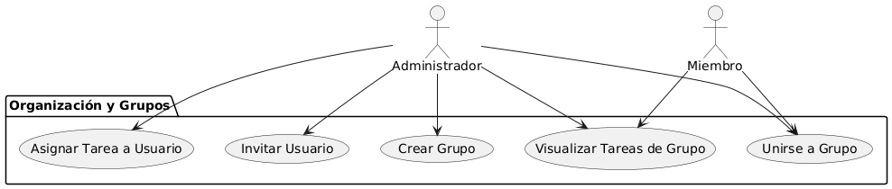
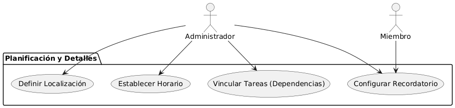

# Digramas Actores y Casos de Uso

## Diagrama de Gestion de Tareas 
| Diagrama | Código Fuente |
|----------|---------------|
| | [Ver código](./diagramaGestionTareas/diagramaGestionTareas.puml) |

## Diagrama de Organizacion y Grupos 
| Diagrama | Código Fuente |
|----------|---------------|
| | [Ver código](./diagramaOrganizaciónYGrupos/diagramaOrganizacionYGrupos.puml) |

## Diagrama de Planificación Y Detalles 

| Diagrama | Código Fuente |
|----------|---------------|
| | [Ver código](./diagramaPlanificaciónYDetalles/diagramaPlanificacionYDetalles.puml) |

## Diagrama de Automatización 

| Diagrama | Código Fuente |
|----------|---------------|
| | [Ver código](./diagramaAutomatización/diagramaAutomatizacion.puml) |

## Diagrama de Contexto 
[Documentación](./diagramaContexto)