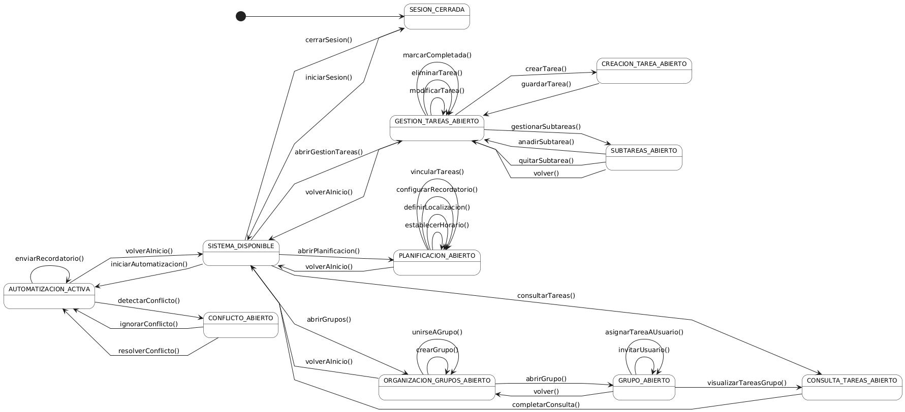

# [Sistema de Gestión de Tareas] > Diagrama de Contexto

## Introducción

Este documento presenta el diagrama de contexto para el flujo principal del sistema, mostrando su perspectiva completa como una máquina de estados. El diagrama especifica la secuencialidad de navegación y las transiciones clave para la gestión central de tareas, organización de grupos, planificación detallada y automatización.

## Propósito

- Mostrar la perspectiva completa del sistema desde el punto de vista del usuario principal.
- Especificar la secuencialidad de navegación mediante estados y transiciones.
- Validar que todos los flujos de gestión de tareas y grupos tienen lugar en el sistema.
- Aplicar un patrón radial centrado en el estado `SISTEMA_DISPONIBLE`.

## Diagrama

|
|-
|Código fuente: [diagramaContexto.puml](diagramaContexto.puml)

## Estados del sistema

|Estado|Descripción|Función principal|
|-|-|-|
|**SESION_CERRADA**|Estado inicial del sistema|Punto de entrada, requiere autenticación|
|**SISTEMA_DISPONIBLE**|Hub central de navegación|Punto de acceso a todos los módulos principales|
|**GESTION_TAREAS_ABIERTO**|Módulo de gestión principal|Visualización, modificación y gestión general de tareas|
|**CREACION_TAREA_ABIERTO**|Creación inicial de una tarea|Recolección de datos mínimos para la creación|
|**SUBTAREAS_ABIERTO**|Gestión de dependencias y subtareas|Adición o eliminación de subtareas específicas|
|**PLANIFICACION_ABIERTO**|Módulo de detalles y horarios|Configuración de horarios, localización y recordatorios|
|**ORGANIZACION_GRUPOS_ABIERTO**|Módulo de listado y gestión de grupos|Creación, unión y visualización de grupos|
|**GRUPO_ABIERTO**|Gestión de grupo específico|Invitación de usuarios y asignación de tareas a miembros|
|**AUTOMATIZACION_ACTIVA**|Módulo de monitoreo|Ejecución de procesos automáticos (recordatorios, detección de conflictos)|
|**CONFLICTO_ABIERTO**|Resolución de conflictos|Presentación de conflictos detectados y opciones de resolución|
|**CONSULTA_TAREAS_ABIERTO**|Módulo de visualización|Visualización de tareas propias o de grupos|

## Transiciones principales

### Autenticación y navegación al menú
- `iniciarSesion()`: SESION_CERRADA → SISTEMA_DISPONIBLE (proceso de autenticación exitoso)
- `cerrarSesion()`: SISTEMA_DISPONIBLE → SESION_CERRADA

### Navegación a módulos principales (desde SISTEMA_DISPONIBLE)
- `abrirGestionTareas()`: SISTEMA_DISPONIBLE → GESTION_TAREAS_ABIERTO
- `abrirPlanificacion()`: SISTEMA_DISPONIBLE → PLANIFICACION_ABIERTO
- `abrirGrupos()`: SISTEMA_DISPONIBLE → ORGANIZACION_GRUPOS_ABIERTO
- `iniciarAutomatizacion()`: SISTEMA_DISPONIBLE → AUTOMATIZACION_ACTIVA
- `consultarTareas()`: SISTEMA_DISPONIBLE → CONSULTA_TAREAS_ABIERTO

### Patrón de Edición y Creación (Módulo GESTIÓN DE TAREAS)
- **GESTION_TAREAS_ABIERTO → crearTarea() → CREACION_TAREA_ABIERTO**: Inicia la creación.
- **CREACION_TAREA_ABIERTO → guardarTarea() → GESTION_TAREAS_ABIERTO**: Finaliza y vuelve.
- **GESTION_TAREAS_ABIERTO → gestionarSubtareas() → SUBTAREAS_ABIERTO**: Inicia la edición de dependencias.
- **SUBTAREAS_ABIERTO → volver() → GESTION_TAREAS_ABIERTO**: Retorno simple.
- **GESTION_TAREAS_ABIERTO → modificarTarea() / eliminarTarea() / marcarCompletada() → GESTION_TAREAS_ABIERTO**: Operaciones in situ (autorreflexivas).

### Patrón de Planificación (Módulo PLANIFICACION)
- **PLANIFICACION_ABIERTO → establecerHorario() / definirLocalizacion() / configurarRecordatorio() / vincularTareas() → PLANIFICACION_ABIERTO**: Todas son operaciones autorreflexivas de edición de detalles.

### Patrón de Grupos (Módulo ORGANIZACIÓN)
- **ORGANIZACION_GRUPOS_ABIERTO → abrirGrupo() → GRUPO_ABIERTO**: Acceso a la gestión de un grupo específico.
- **GRUPO_ABIERTO → visualizarTareasGrupo() → CONSULTA_TAREAS_ABIERTO**: Enlace a la consulta de tareas.

### Patrón de Automatización
- **AUTOMATIZACION_ACTIVA → detectarConflicto() → CONFLICTO_ABIERTO**: Flujo de detección.
- **CONFLICTO_ABIERTO → resolverConflicto() / ignorarConflicto() → AUTOMATIZACION_ACTIVA**: Flujo de resolución.

### Retorno al Menú Principal (Hub Central)
- `volverAInicio()`: Usada por ListTareas, EditDetalles, ListGrupos, Auto.
- `completarConsulta()`: Usada por Consulta.

## Precondiciones visuales

### Autenticación requerida
El diagrama hace explícito que para acceder a `SISTEMA_DISPONIBLE`, el usuario debe completar `iniciarSesion()` desde el estado `SESION_CERRADA`.

### Navegación centralizada desde menú
El acceso a los módulos principales requiere pasar por `SISTEMA_DISPONIBLE`.

### Flujos de trabajo
- **Gestión**: `GESTION_TAREAS_ABIERTO` es el punto de inicio para todas las operaciones CRUD.
- **Subtareas**: La gestión de subtareas (`SUBTAREAS_ABIERTO`) es un sub-flujo que regresa a la gestión principal.

## Validación de flujos

### Cobertura de casos de uso
- **Gestión de Tareas**: Cubre creación, modificación, eliminación, completado y gestión de subtareas.
- **Grupos**: Cubre creación, unión, acceso a detalles del grupo, asignación de tareas a miembros y consulta de tareas del grupo.
- **Planificación**: Cubre la definición de todos los detalles espaciales y temporales de la tarea.
- **Automatización**: Cubre la detección, resolución e ignorancia de conflictos de horario.

### Optimización del flujo
- **Patrón radial**: Mantiene el `SISTEMA_DISPONIBLE` como el hub central para una navegación intuitiva y clara.
- **Operaciones in situ**: Las operaciones de edición y eliminación que no cambian el contexto (ej., `eliminarTarea()`) son autorreflexivas, minimizando el cambio de estado.

## Características del diseño

### Patrón Hub Central
El `SISTEMA_DISPONIBLE` actúa como punto central, concentrando el inicio de todos los flujos principales.

### Granularidad Descriptiva
Los estados son lo suficientemente específicos (ej., `CREACION_TAREA_ABIERTO` vs. `GESTION_TAREAS_ABIERTO`) para distinguir las fases de la interacción del usuario.

### Separación de Responsabilidades
- **Flujo de Tareas**: Claramente separado del flujo de **Grupos** y del flujo de **Automatización**.
- **`iniciarSesion()`**: Proceso de autenticación.
- **`volverAInicio()`**: Navegación de regreso al menú principal desde cualquier módulo.