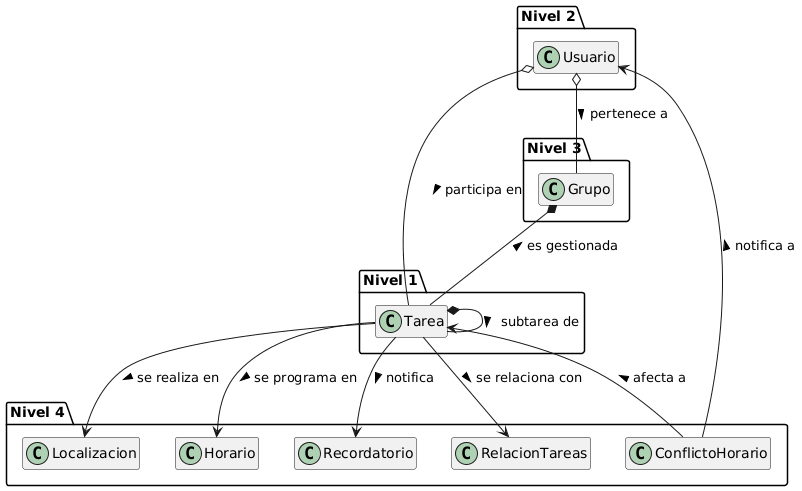
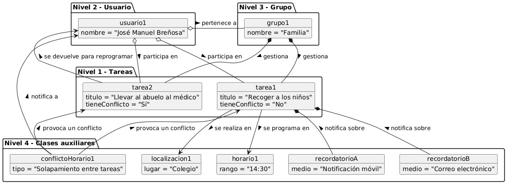
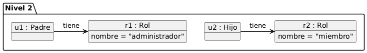
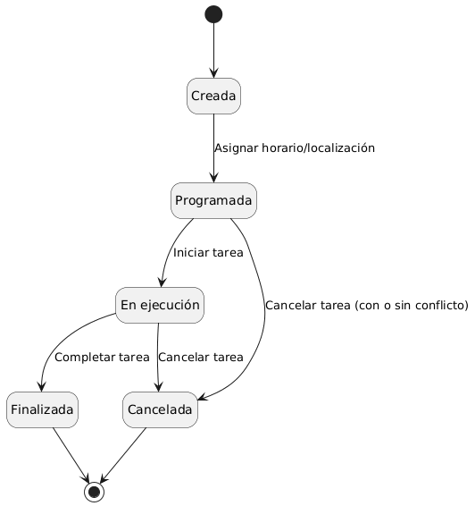
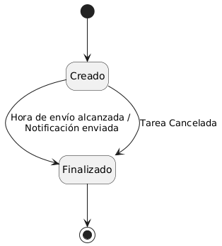
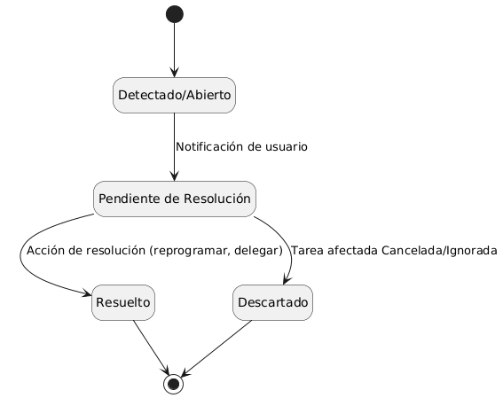

# Modelo de Dominio

## Diagrama de Clases 
| Diagrama | Código Fuente |
|----------|---------------|
| | [Ver código](./diagramaClases/diagramaClases.puml) [Ver Explicación](./diagramaClases/diagramaClases.md) |

## Diagrama de Objetos 
| Diagrama | Código Fuente |
|----------|---------------|
| | [Ver código](./diagramaObjetos/diagramaObjetos.puml) |

## Diagrama de Objetos Rol
| Diagrama | Código Fuente |
|----------|---------------|
| | [Ver código](./diagramaObjetos/diagramaObjetosRol.puml) |

## Diagramas de Estados 

### Ciclo de Vida de Tarea
| Diagrama | Código Fuente |
|----------|---------------|
| | [Ver código](./diagramaEstados/diagramaEstadosTarea.puml) |

### Ciclo de Vida Recordatorio
| Diagrama | Código Fuente |
|----------|---------------|
| | [Ver código](./diagramaEstados/diagramaEstadosRecordatorio.puml) |

### Ciclo de Vida Conflicto Horario
| Diagrama | Código Fuente |
|----------|---------------|
| | [Ver código](./diagramaEstados/diagramaEstadosConflictoHorario.puml) |
