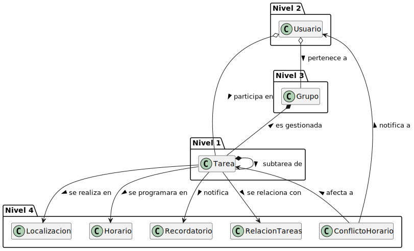
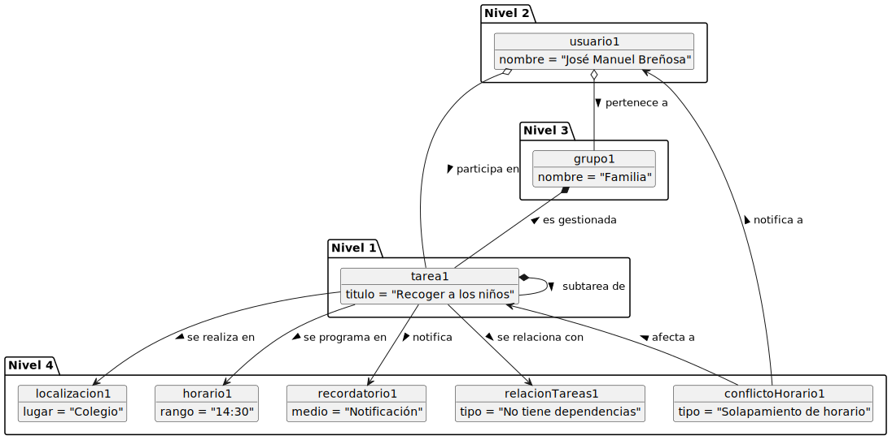
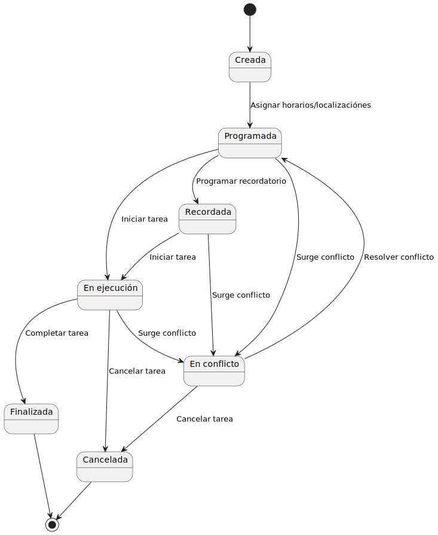

# Modelo de Dominio

## Diagrama de Clases 
| Diagrama | Código Fuente |
|----------|---------------|
| | [Ver código](./diagramaClases/diagramaClases.puml) [Ver Explicación](./diagramaClases/diagramaClases.md) |

## Diagrama de Objetos 
| Diagrama | Código Fuente |
|----------|---------------|
| | [Ver código](./diagramaObjetos/diagramaObjetos.puml) |

## Diagrama de Estados 

### Ciclo de Vida de Tarea
| Diagrama | Código Fuente |
|----------|---------------|
| | [Ver código](./diagramaEstados/diagramaEstados.puml) |
